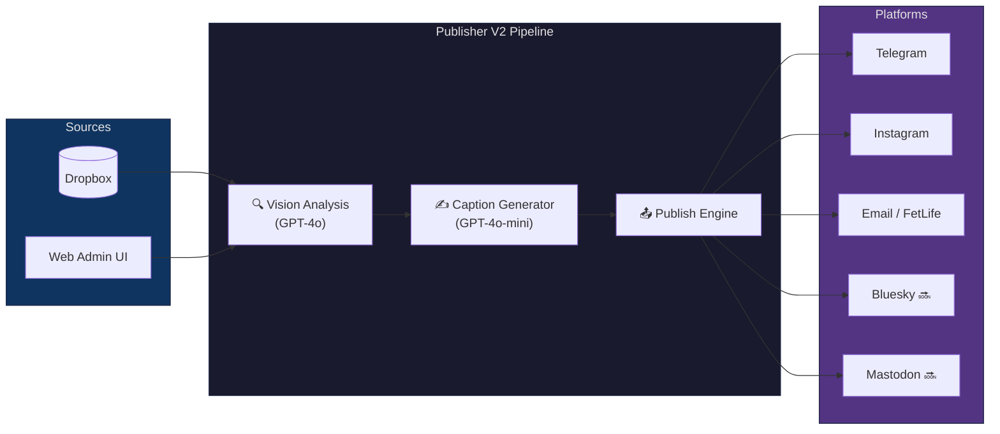

<div align="center">

# 📸 Social Media Publisher

**AI-powered photo publishing pipeline — from Dropbox to Telegram, Instagram, Email & more**

[](https://www.python.org/downloads/)
[](https://github.com/dhirmadi/SocialMediaPythonPublisher/actions/workflows/code-quality.yml)
[](https://github.com/dhirmadi/SocialMediaPythonPublisher/actions/workflows/security-scan.yml)
[](https://github.com/astral-sh/uv)
[](https://github.com/astral-sh/ruff)
[](LICENSE)

</div>

---

Drop your photos in Dropbox. The publisher picks them up, generates platform-tailored captions with OpenAI Vision, and posts them — to Telegram channels, Instagram, email lists (including FetLife), or any combination. A mobile-first web admin UI lets you curate, analyze, and publish manually when you want control.

<!-- TODO: Add a screenshot of the web UI here

-->

## ✨ Key Features

| | Feature | Details |
|:---:|---------|---------|
| 🤖 | **AI-Generated Captions** | OpenAI Vision analyzes each image; separate models for vision analysis and caption writing optimize cost vs. quality |
| 🎯 | **Platform-Adaptive** | Captions are tailored per platform — length, tone, hashtags, and formatting rules are all platform-aware |
| 🗣️ | **Brand Voice Matching** | Feed the AI your writing samples and it matches your personal voice and style |
| 🏷️ | **Smart Hashtags** | Context-aware hashtag generation tuned to each platform's culture |
| 📦 | **Dropbox Integration** | Images sourced from Dropbox; server-side archive moves keep your folder clean |
| 🔁 | **Deduplication** | SHA256 content hashing prevents reposting the same image — ever |
| 🌐 | **Web Admin UI** | Mobile-first FastAPI interface for browsing, analyzing, curating, and publishing photos |
| 📤 | **Multi-Platform** | Telegram, Instagram, Email/FetLife out of the box — Bluesky and Mastodon on the [roadmap](#-roadmap) |
| ☁️ | **Multi-Tenant** | Designed for the [Platform Orchestrator](https://github.com/dhirmadi/platform-orchestrator) — run multiple independent instances from one deployment |
| 🔒 | **Secure by Default** | Auth0 login, signed admin cookies, structured logging with secret redaction |
| 👁️ | **Safe Preview Mode** | Full dry-run with zero side effects — see exactly what would be published without touching anything |

## 🏗️ How It Works



## 🚀 Quick Start

### Prerequisites

- **Python 3.12+**
- **[uv](https://docs.astral.sh/uv/)** — fast Python package manager

### Install & Run

```bash
# Clone the repo
git clone https://github.com/dhirmadi/SocialMediaPythonPublisher.git
cd SocialMediaPythonPublisher

# Install dependencies
uv sync

# Copy the example env and fill in your API keys
cp dotenv.v2.example .env
# Edit .env with your Dropbox, OpenAI, and publisher credentials

# Preview mode — see what would happen, no side effects
make preview-v2

# Publish for real
make run-v2
```

### Run the Web UI

```bash
uv run uvicorn publisher_v2.web.app:app --reload
# Open http://localhost:8000
```

## 🧭 CLI

All commands go through `make` or `uv run`:

```bash
# Preview (safe, read-only — no side effects)
make preview-v2

# Publish a specific image
PYTHONPATH=publisher_v2/src uv run python publisher_v2/src/publisher_v2/app.py --select my-photo.jpg

# Dry run — full pipeline, skips actual platform calls and archiving
PYTHONPATH=publisher_v2/src uv run python publisher_v2/src/publisher_v2/app.py --dry-publish
```

Preview mode shows: image details (temp link, SHA256), vision analysis (description, mood, tags, safety rating), final caption with character count, per-platform formatting, and for Email/FetLife the subject preview and caption placement.

## ⚙️ Configuration

Publisher V2 uses a **three-layer configuration model**:

| Layer | Source | What goes here |
|-------|--------|---------------|
| **Secrets** | `.env` only | API keys, passwords, tokens |
| **Dynamic config** | `.env` (JSON-valued) | Feature toggles, platform settings, folders |
| **Static config** | YAML files | AI prompts, platform limits, UI text |

<details>
<summary><strong>Example <code>.env</code> (click to expand)</strong></summary>

```bash
# Secrets
DROPBOX_APP_KEY=your_key
DROPBOX_APP_SECRET=your_secret
DROPBOX_REFRESH_TOKEN=your_token
OPENAI_API_KEY=sk-...
TELEGRAM_BOT_TOKEN=your_bot_token

# Dynamic config (JSON-valued env vars)
STORAGE_PATHS={"root": "/Photos/my_folder", "archive": "archive"}
PUBLISHERS=[{"type": "telegram", "channel_id": "-100..."}]
OPENAI_SETTINGS={"vision_model": "gpt-4o", "caption_model": "gpt-4o-mini"}
```

</details>

📖 **Full reference:** [`docs_v2/05_Configuration/CONFIGURATION.md`](docs_v2/05_Configuration/CONFIGURATION.md) — all env vars, OpenAI model selection, platform-specific options, feature toggles, and i18n.

## 📁 Project Structure

```
publisher_v2/
├── src/publisher_v2/
│   ├── app.py              # CLI entrypoint
│   ├── config/             # Pydantic v2 config models, loaders, credentials
│   ├── core/               # Domain models, WorkflowOrchestrator, exceptions
│   ├── services/
│   │   ├── ai/             # OpenAI Vision analysis + caption generation
│   │   ├── storage/        # Dropbox adapter, R2 managed storage
│   │   └── publishers/     # Telegram, Instagram, Email/FetLife
│   ├── utils/              # Logging, rate limiting, state, image processing
│   └── web/                # FastAPI app, Auth0 auth, routers, templates
└── tests/                  # Comprehensive test suite, 85%+ coverage
```

## 🧪 Development

```bash
make install-dev    # Install with dev dependencies
make format         # Format + auto-fix lint (ruff)
make lint           # Lint check
make type-check     # mypy
make test           # Tests + coverage report
make check          # All of the above
```

| Tool | Purpose | Config |
|------|---------|--------|
| [uv](https://docs.astral.sh/uv/) | Package management | `pyproject.toml` + `uv.lock` |
| [ruff](https://docs.astral.sh/ruff/) | Linting + formatting | `pyproject.toml [tool.ruff]` |
| [mypy](https://mypy.readthedocs.io/) | Type checking | `pyproject.toml [tool.mypy]` |
| [pytest](https://docs.pytest.org/) | Testing (async-native) | `pyproject.toml [tool.pytest]` |
| [pre-commit](https://pre-commit.com/) | Git hooks: ruff, bandit, detect-secrets, gitleaks | `.pre-commit-config.yaml` |

## 📚 Documentation

Detailed documentation lives in [`docs_v2/`](docs_v2/):

- **[System Design](docs_v2/03_Architecture/SYSTEM_DESIGN.md)** — goals, scope, user journeys
- **[Architecture](docs_v2/03_Architecture/ARCHITECTURE.md)** — components, interfaces, deployment
- **[Configuration](docs_v2/05_Configuration/CONFIGURATION.md)** — env vars, feature flags, i18n
- **[Specification](docs_v2/02_Specifications/SPECIFICATION.md)** — API contracts, data models
- **[AI & Prompts](docs_v2/07_AI/AI_PROMPTS_AND_MODELS.md)** — model selection, prompting strategies
- **[Security & Privacy](docs_v2/04_Security_Privacy/SECURITY_PRIVACY.md)** — secrets, sessions, PII
- **[Product Roadmap](docs_v2/roadmap/README.md)** — 80+ items tracked, 55+ shipped

## 🗺️ Roadmap

The project follows a [spec-driven roadmap](docs_v2/roadmap/README.md) with 80+ tracked items. Current priorities:

- 🔜 **Bluesky publisher** ([PUB-027](docs_v2/roadmap/PUB-027_bluesky-publisher.md))
- 🔜 **Mastodon / Fediverse publisher** ([PUB-030](docs_v2/roadmap/PUB-030_mastodon-fediverse-publisher.md))
- 🔜 **Caption candidate selection** ([PUB-052](docs_v2/roadmap/PUB-052_caption-candidate-selection.md)) — generate multiple candidates and pick the best
- 🏗️ **Shared-dyno tenant isolation** ([PUB-053](docs_v2/roadmap/PUB-053_shared-dyno-isolation.md))
- 🏗️ **Workflow stages refactor** ([PUB-058](docs_v2/roadmap/PUB-058_workflow-stages-and-layering.md))

See the full [roadmap](docs_v2/roadmap/README.md) for the complete backlog and execution order.

## 🤝 Contributing

Contributions are welcome! This project uses a **spec-driven, test-first** workflow:

1. **Check the [roadmap](docs_v2/roadmap/README.md)** — your idea might already be tracked
2. **[Open an issue](https://github.com/dhirmadi/SocialMediaPythonPublisher/issues)** to discuss the change before writing code
3. **Write tests first** (TDD) — tests codify the expected behavior
4. **Keep it focused** — small, surgical PRs are preferred over wide refactors
5. **Run the quality gates** before submitting:
   ```bash
   make check   # format + lint + type-check + tests
   ```

### Code Style

- Python 3.12+, line length 120, double quotes
- Type annotations on all public functions
- Structured logging via `log_json` — never `print()`
- Async functions must stay non-blocking

## 📄 License

This project is licensed under the **GNU General Public License v3.0** — see the [LICENSE](LICENSE) file for details.
